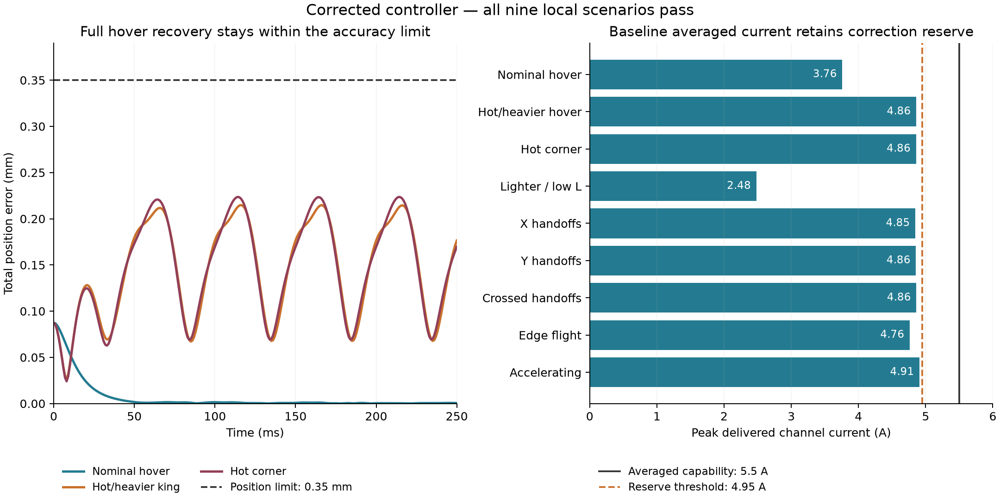

# Electrical and timing candidate qualification

**All nine local king scenarios now pass. The current-critical case also passes independent integration-step, magnetic-field-refresh and force-mesh convergence checks.** This supports a prototype design basis under the stated assumptions. It does not qualify the complete product or establish absolute minimum current/frequency values.

The saved results predate the repository reorganization; their original source fingerprints are preserved. See [README.md](README.md) for current execution commands and provenance.

The results are in [qualification.json](results/qualification.json). Quantitative settings belong to `Inputs`, `Fixed` and `Constants` in `model.py`, with descriptive parameter comments. Neither protected product document was modified by this work.

## Provisional prototype targets

| Quantity | Target | Meaning |
|---|---:|---|
| Winding | 57 turns, 0.956 × 0.05 mm bare flat conductor | Existing selected geometry; approximately 4.218 mm winding height; supplier/process confirmation outstanding |
| Full split bus | 40 V | ±20 V rails; modeled usable commanded voltage ±18 V per coil |
| Regulated current capability | ±5.5 A/channel | Cycle-average capability, with at least 10% spare capacity required in the local tests |
| Instantaneous power-stage/protection target | 6.5 A/channel | Separate provisional target including switching ripple; transient/device validation required |
| Pose feedback | 1 kHz | Delayed position/orientation measurements |
| Current-pattern commands | 4 kHz | Update coil-current allocations during movement and handoffs |
| Current-regulator updates | 20 kHz | Sampled PI current regulation; modeled bandwidth 2 kHz |
| PWM carrier | 160 kHz | Provisional target for the existing split-rail half-bridge topology, selected from the ripple screen |

The pose and command rates are unchanged. The PWM carrier increased from 20 kHz because its previous value was not supported by the winding-inductance/ripple calculation. The current regulator continues to update at 20 kHz. Carrier frequency is an electronics/topology choice and must not be confused with pose feedback, current commands or loop bandwidth.

The sustained workload remains the user-selected **10 composite moves/minute**. Individual lift/fly/land timing and peak flight speed are unchanged.

## What changed and why

The previous moving-case convergence failure came from holding magnetic force constant between numerical field refreshes. With the old controller, halving the integration step alone changed peak tip error by only **0.263 µm**; doubling the field-refresh rate changed it by **89.147 µm**. At maximum speed, a 1 ms field hold spans about 1.15 mm of travel, almost the 1.25 mm handoff transition. The numerical plant now refreshes its field at 4 kHz, independently of the physical feedback rate. [qualification_numerics.json](results/qualification_numerics.json) preserves that isolated diagnosis.

The pose observer now estimates position, velocity and an unknown acceleration disturbance from delayed pose measurements and its own commanded accelerations. The controller compensates that estimate. It is not given true velocity, actual mass, hot magnet strength or the simulated disturbance. This removes the persistent hot-hover drift that the previous position/velocity observer could not reject. The existing observer pole-frequency setting is reused. This is the disturbance-estimation approach described in [MathWorks' extended-state-observer documentation](https://www.mathworks.com/help/slcontrol/ug/extended-state-observers-and-disturbance-compensation.html); the chess results come from this project's own model.

The allocator additionally leaves **0.1 A** for regulator transients, beyond current-sense offset and command quantization. Its normal command ceiling is **4.795 A**, derived from the 5.5 A capability, 10% reserve, 50 mA offset, 5 mA quantization allowance and 0.1 A transient allowance. Demand exceeding that allocation ceiling is still reported; hardware clipping and engineering failures are not hidden. No tracking or reserve limit was relaxed.

## Dynamic results

The following are baseline results with the corrected controller and finer numerical field refresh. Currents are from the PWM-averaged model.

| Case | Peak averaged current | Peak position error | Peak lateral tip error | Result |
|---|---:|---:|---:|---|
| Nominal hover | 3.760 A | 0.0875 mm | 0.2163 mm | PASS |
| Hot/heavier king hover | 4.860 A | 0.2148 mm | 0.4295 mm | PASS |
| Hot corner hover | 4.858 A | 0.2237 mm | 0.4248 mm | PASS |
| Lighter king, low inductance | 2.480 A | 0.1940 mm | 0.4292 mm | PASS |
| Fast X handoffs | 4.847 A | 0.1292 mm | 0.3557 mm | PASS |
| Fast Y handoffs | 4.856 A | 0.1446 mm | 0.3609 mm | PASS |
| Crossed handoffs | 4.863 A | 0.1178 mm | 0.4119 mm | PASS |
| Fast edge flight | 4.763 A | 0.1257 mm | 0.3458 mm | PASS |
| Accelerating handoff | 4.909 A | 0.1520 mm | 0.4109 mm | PASS |

Both previously failing hot hovers now complete their full **250 ms** intervals. Their peak position errors are **0.215 mm** and **0.224 mm**, below the **0.350 mm** hover limit, with more than **11.6%** current reserve. All moving cases complete their one-lattice-period segments, approximately 26–37 ms long. These remain local segments, not complete lift/fly/land trajectories.

Including the accelerating-case refinements, observed maxima are:

- **4.919 A** delivered averaged channel current; at least **10.57%** reserve in that refined case.
- **6.877 V** active commanded voltage per coil, within the available ±18 V.
- **465.6 W** instantaneous copper loss and **478.7 W** coil-terminal power.
- No clipped current commands, no active drive-voltage saturation, and all modeled midpoint-current checks pass.

The corrected controller requires stronger corrective forces than the previous failing controller. Consequently the observed short-term power is higher than the earlier approximately 220 W result. These local peaks are not complete power-supply ratings and do not include a switched electromechanical trajectory.

## Numerical verification

The accelerating handoff is the case with the least current reserve. It was repeated separately with doubled integration resolution, doubled magnetic-field refresh and doubled force discretization. The hardware pose, command and current-regulator rates remained fixed.

| Refinement | Peak-tip difference | Largest common-time position difference | Peak averaged-current difference |
|---|---:|---:|---:|
| Integration step | 0.245 µm | 0.143 µm | 3.753 mA |
| Field refresh | 6.149 µm | 13.502 µm | 10.293 mA |
| Force mesh | 0.024 µm | 0.225 µm | 8.605 mA |

All refinement checks pass. The check now compares complete common-time position traces, peak position/tip errors, requested/delivered currents, electrical power and acceptance outcomes. Its model-owned tolerance is applied to the relevant position/tip budget, reserved current and peak power. Convergence is demonstrated for this current-critical segment, not independently for every scenario.

The saved results include execution-source fingerprints for individual runs. Some runs precede the report refactor and the separation of the carrier and regulator parameter names. Equivalence was checked by comparing the simulation functions after that name substitution, verifying every consumed setting retained its value, and confirming the magnetic simulator was unchanged. A fresh accelerating-case run after separation reproduces its complete trace and metrics exactly. The aggregate also fingerprints the current report/model sources. The previous failed refinement is retained as [qualification_previous_refinement.json](results/qualification_previous_refinement.json), explicitly historical.

## Switching ripple and electrical losses

The dynamic simulator uses averaged coil voltage. That was insufficient to call its current values instantaneous hardware ratings.

For the existing split-rail half-bridge, `split_rail_ripple_peak()` evaluates the exact periodic independent-RL waveform and its maximum deviation from mean current over all duty cycles. With nominal estimated inductance **0.1452 mH**, the assumed lower bound is **0.0726 mH**. At that lower bound, the old 20 kHz carrier gives a conservative **3.424 A** peak-deviation bound. Thus the old carrier could not support the current rating as previously interpreted.

At **160 kHz**, the corresponding bound is **0.430 A**, below the model's **0.5 A** ripple allowance. Full 5.5 A averaged delivery plus this bound is **5.930 A**, below the provisional **6.5 A** instantaneous target. This is a periodic RL screen, not proof of arbitrary duty-transition, dead-time, sensing, regeneration or rail-transient behaviour. The bound relies on the assumed minimum inductance; a measured lower value would require revisiting the carrier or drive topology. TI discusses the low-inductance carrier/ripple tradeoff in its [motor-drive technical article](https://www.ti.com.cn/document-viewer/cn/lit/html/SSZTAJ4/GUID-FB9AA6C5-4129-4543-AA91-E7BC0E394470).

`last_run.txt` now includes the higher switching frequency and conservative ripple contributions to conduction, switching and shunt losses. The ripple-heating contribution conservatively applies a per-channel variance bound to every active channel. The main report's conservative isolated-piece reset sum is now approximately **1.079 kW peak**, with a **548 W sustained sizing requirement** under its hot-bound assumptions. The existing PSU has not been reselected or downsized. Thermal, parked-hover and showpiece endurance failures remain visible.

## Assumptions and remaining limits

The reference remains the same simple bottom-heavy geometric king: **23.38 g**, including **12 g** of magnets, with COM **24.30 mm** above the magnet bottom. No CAD-derived distribution is assumed. Tests vary mass by ±10%, COM height by ±20%, principal inertias by ±25%, and self-inductance between half and twice the estimate. Hot cases use 105°C copper and 77°C magnets. Those bounds are assumptions, not measurements or probability estimates.

Injected pose error remains bounded at 160 µm position and 5 mrad orientation, using bias plus a sinusoid, with 1 ms additional measurement age. The observer uses measurement timing to propagate its estimate. These tests do not cover every admissible noise waveform or latency-jitter pattern. The electronics must provide timestamps, latency and cycle-average current sensing consistent with the modeled controller.

The existing Hall calculation predicts about 294 µm total docking error and 345 µm transit error. It does not establish the assumed 160 µm sensing bound. Likewise its 4.60 mrad tilt-noise estimate does not establish a guaranteed 5 mrad bound. Sensing remains a separate design problem.

The present whole-board command stream is **221.184 Mbit/s**, against a configured **40 Mbit/s** link. Command locality or parallel delivery needs an architecture change. Offline SciPy allocations also do not prove that a hardware implementation meets the 250 µs command deadline. The modeled PI response is a requirement for the electronics; the existing comparator-based implementation has not demonstrated it.

Coils begin pre-energized. The model does not yet qualify ground takeoff/contact transitions, complete flights, deliberate large tilt/yaw manoeuvres, stationary neighbours, full-board reset routing, mutual inductance, actual PWM sensing/switching transients, rail/midpoint dynamics, or thermal/acoustic acceptance. The king's current demand does not establish the fastest dynamics of every lighter piece.

## Next work

Use the targets above as a **conditional prototype design basis**. Further searching for minimum pose or command frequency is not the useful next step.

First confirm the real winding and a representative current driver: supplier-achievable conductor/insulation dimensions, cold/hot resistance, self/mutual inductance, measured force, current-loop response, switching ripple, current-sense error and temperature. Design the driver around the distinction between averaged and instantaneous current. Carrier/topology changes must carry their electrical losses back into the existing model.

In parallel, adapt sensing and command delivery to the demonstrated timing/accuracy contract. Continue full lift/fly/land and neighbour simulations using this corrected controller, and resolve whole-board power/thermal failures before selecting production electronics. Passing local scenarios provides no unconditional guarantee of piece control on real hardware.

Verification: **46 regression tests pass**, including disturbance estimation, clock independence, periodic RL ripple bounds and trajectory/current convergence checks. The main report was recalculated. Both protected product documents match their pre-work hashes.

The proposed implementation sequence is in [NEXT_STEPS.md](NEXT_STEPS.md).
